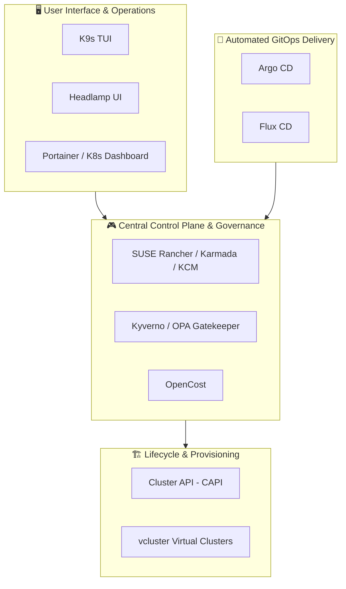

# ☸️ Awesome Kubernetes Management Platform Ecosystem

> **A curated, battle-tested list of Enterprise SaaS Products & Open-Source GitHub Projects for Kubernetes Management.**  
> Focused on **Multi-Cluster Management**, **Cluster Lifecycle Automation**, **GitOps**, **Cost Visibility**, and **Platform Engineering**.

---

## 📌 Table of Contents

- [📊 Sector Market Overview & Dynamics](#-sector-market-overview--dynamics)
- [🏢 SaaS & Managed Enterprise Platforms](#-saas--managed-enterprise-platforms)
- [⭐ Open-Source GitHub Projects (Ranked by Stars)](#-open-source-github-projects-ranked-by-stars)
- [🛠️ Architectural Ecosystem Guidance](#️-architectural-ecosystem-guidance)
- [🤝 How to Contribute](#-how-to-contribute)
- [⚖️ Disclaimer](#️-disclaimer)

---

## 📊 Sector Market Overview & Dynamics

📈 **Market Size & Valuation:** The global **Kubernetes Management Platform (KMP)** market is estimated at **$3.13 Billion – $3.46 Billion in 2026**, expanding rapidly at a CAGR of **~17% to 20%**. 

🧩 **Market Concentration & Structure:** The sector exhibits a **moderate level of market concentration**:
* **Hyperscaler Dominance:** Managed Kubernetes services (AWS EKS, Google GKE, Azure AKS) hold ~63% of raw infrastructure management volume.
* **Moderate Fragmentation:** Outside standard cloud-managed Kubernetes, the platform management market remains **moderately fragmented**. Independent enterprise vendors and open-source projects compete fiercely on multi-cluster governance, hybrid/bare-metal flexibility, Day-2 lifecycle automation, GitOps integration, and cost optimization.

---

## 🏢 SaaS & Managed Enterprise Platforms

Below is a detailed comparison of leading enterprise SaaS and managed platforms. The table is sorted by **Company Size / Valuation / Revenue (Descending)**.

| 🏢 Platform / Vendor | 💰 Company Valuation / Revenue | 💵 Starting Tier Price | 🎁 Free Tier Limit / Trial Details | 🚀 Core Capabilities & Use Case |
| :--- | :--- | :--- | :--- | :--- |
| **[SUSE Rancher](https://www.rancher.com)** ☸️ | **~$2.5B Valuation**  *(~$700M ARR - Parent SUSE)* | **$1,000 / node / year**  *(~$83.33/node/mo - Rancher Prime)* | **100% Free Open-Source**  *(Community Edition free forever for unlimited clusters)* | Leading multi-cluster management platform. Provisions & operates RKE2, K3s, EKS, GKE, and AKS with centralized RBAC and Fleet GitOps. |
| **[Canonical (Charmed K8s)](https://canonical.com/kubernetes)** 🟠 | **~$1.0B Valuation**  *(~$175M ARR)* | **$225 / node / year**  *(~$18.75/node/mo via Ubuntu Pro)* | **Free for up to 5 nodes**  *(Ubuntu Pro free forever tier for personal & small use)* | Composable, automated Kubernetes lifecycle distribution leveraging Juju charms across public clouds, OpenStack, and bare metal. |
| **[Spectro Cloud Palette](https://www.spectrocloud.com)** 🎨 | **~$500M Valuation**  *($75M+ Series C Funding)* | **$15 / node / month**  *(Palette SaaS tier)* | **30-Day Free Trial**  *(Includes 50 node-hours & up to 5 managed clusters)* | Enterprise full-stack lifecycle management using Cluster Profiles. GigaOm Leader in declarative drift auto-remediation down to OS kernel level. |
| **[Mirantis (MKE & Lens)](https://www.mirantis.com)** 🐳 | **~$400M Valuation**  *(~$100M ARR)* | **$19.90 / user / month**  *(Lens Pro; MKE starts at $1,200/node/yr)* | **Free Forever (Lens Personal)**  *(Free for devs & startups <$10M rev; MKE has 30-day free trial)* | Enterprise container platform supporting Kubernetes and Docker Swarm side-by-side. Includes Lens Desktop IDE for developer productivity. |
| **[Platform9](https://platform9.com)** 🌐 | **~$250M Valuation**  *($70M+ Funding Raised)* | **$99 / node / year**  *(~$8.25/node/mo for Managed Growth)* | **Free Forever for 3 Clusters**  *(Up to 8 nodes free forever with full SaaS control plane)* | Fully managed SaaS control plane for multi-cloud, on-premises, and edge Kubernetes with 99.9% SLA guarantees and zero-friction ops. |
| **[Loft Labs (vcluster & Loft)](https://loft.sh)** 🚀 | **~$150M Valuation**  *($37M+ Funding Raised)* | **$20 / user / month**  *(or $15/node/mo for Loft Enterprise)* | **100% Free (vcluster OSS)**  *(Loft Enterprise offers 14-day free trial for up to 5 vclusters)* | Virtual Kubernetes cluster platform for enterprise multi-tenancy, rapid namespace isolation, and developer self-service cost control. |
| **[Rafay Systems](https://rafay.co)** 🛡️ | **~$150M Valuation**  *($45M+ Funding Raised)* | **$35 / cluster / month**  *(Kubernetes Operations Platform)* | **30-Day Free Trial**  *(Full feature access for up to 5 managed clusters)* | Kubernetes Operations Platform (KOP) providing multi-cluster lifecycle, zero-trust access, network automation, and policy governance. |
| **[Kubermatic](https://www.kubermatic.com)** 🇪🇺 | **~$30M - $50M Valuation**  *(Private / European Enterprise)* | **€500 / cluster / month**  *(Enterprise Edition KKP)* | **Free Forever (KKP Community)**  *(100% free open-source for up to 3 master control planes)* | Automated multi-cluster platform for managing Kubernetes fleets across multi-cloud, edge, and on-premises bare metal environments. |
| **[Giant Swarm](https://www.giantswarm.io)** 🐝 | **~$25M - $35M Valuation**  *(Private / Managed Services)* | **€2,500 / month**  *(Per managed control plane + worker nodes)* | **30-Day Dedicated POC**  *(Full hands-on trial environment available upon request)* | European enterprise managed Kubernetes platform offering 24/7 reliability engineering, GitOps-first cluster operation, and strict compliance. |
| **[Kublr](https://www.kublr.com)** 🧱 | **~$15M - $20M Valuation**  *(Private / Enterprise)* | **$100 / cluster / month**  *(Basic Control Plane SaaS)* | **Free Forever (Developer Tier)**  *(Free for 1 cluster up to 3 nodes forever)* | Multi-cloud and air-gapped enterprise Kubernetes platform featuring centralized control, auto-scaling, and built-in disaster recovery. |

---

## ⭐ Open-Source GitHub Projects (Ranked by Stars)

Below is an expanded list of top open-source Kubernetes management tools, engines, dashboards, GitOps operators, and control plane frameworks. 

The list is sorted by **GitHub Star Count (Descending)**.

| 📦 Project Name | ⭐ GitHub Stars Badge | 🏷️ Primary Category | 📝 Description & Highlights | ⚖️ License |
| :--- | :--- | :--- | :--- | :--- |
| **[Portainer](https://github.com/portainer/portainer)** |  | `Container & K8s GUI` | Lightweight management UI for Kubernetes, Docker, Swarm, and Podman. Features central dashboard and built-in RBAC. | zlib / Commercial |
| **[K9s](https://github.com/derailed/k9s)** |  | `Terminal UI (TUI)` | Ultra-fast, keyboard-driven terminal UI to monitor, inspect, manage, and debug Kubernetes clusters in real time. | Apache-2.0 |
| **[SUSE Rancher](https://github.com/rancher/rancher)** |  | `Multi-Cluster Platform` | Open-source enterprise management stack for RKE2, K3s, EKS, GKE, AKS, and bare-metal cluster orchestration. | Apache-2.0 |
| **[Argo CD](https://github.com/argoproj/argo-cd)** |  | `GitOps Engine` | CNCF Graduated declarative, GitOps continuous delivery tool for single and multi-cluster Kubernetes deployments. | Apache-2.0 |
| **[KubeSphere](https://github.com/kubesphere/kubesphere)** |  | `Distributed Cloud OS` | Cloud-native operating system providing multi-tenant dashboard, DevOps pipelines, service mesh (Istio), and app store. | Apache-2.0 |
| **[Kubernetes Dashboard](https://github.com/kubernetes/dashboard)** |  | `Web UI` | Official web-based user interface for managing workloads, pods, services, storage, and cluster RBAC resources. | Apache-2.0 |
| **[vcluster](https://github.com/loft-sh/vcluster)** |  | `Virtual Clusters` | Create lightweight, isolated virtual Kubernetes clusters inside a namespace of an underlying host cluster. | Apache-2.0 |
| **[Flux CD](https://github.com/fluxcd/flux2)** |  | `GitOps Toolkit` | CNCF Graduated set of continuous and progressive delivery solutions for Kubernetes, built for infrastructure & apps. | Apache-2.0 |
| **[Kyverno](https://github.com/kyverno/kyverno)** |  | `Policy & Governance` | Kubernetes-native policy engine designed for validation, mutation, generation, and image verification without Rego. | Apache-2.0 |
| **[Headlamp](https://github.com/headlamp-k8s/headlamp)** |  | `Extensible UI / Desktop` | CNCF Sandbox multi-cluster Kubernetes web & desktop UI created by Kinvolk (Microsoft) with full plugin architecture. | Apache-2.0 |
| **[OpenCost](https://github.com/opencost/opencost)** |  | `Cost Management` | CNCF Sandbox real-time cost monitoring and resource allocation engine for Kubernetes across cloud providers. | Apache-2.0 |
| **[Karmada](https://github.com/karmada-io/karmada)** |  | `Multi-Cluster Orchestrator` | CNCF Graduated multi-cloud orchestrator providing centralized resource placement, failover, and scheduling. | Apache-2.0 |
| **[Cluster API](https://github.com/kubernetes-sigs/cluster-api)** |  | `Lifecycle Framework` | Kubernetes Subproject providing declarative APIs and tooling to simplify provisioning and lifecycle across 30+ clouds. | Apache-2.0 |
| **[OPA Gatekeeper](https://github.com/open-policy-agent/gatekeeper)** |  | `Admission Controller` | Custom admission controller integrating Open Policy Agent (OPA) to enforce CRD-based policies using Rego. | Apache-2.0 |
| **[Liqo](https://github.com/liqotech/liqo)** |  | `Multi-Cluster Peer` | CNCF Sandbox project for dynamic multi-cluster topology and workload offloading across edge and cloud environments. | Apache-2.0 |
| **[Deckhouse](https://github.com/deckhouse/deckhouse)** |  | `NoOps K8s Platform` | Fully automated Kubernetes platform offering NoOps cluster management, integrated monitoring, and ingress control. | Apache-2.0 |
| **[k0rdent (KCM)](https://github.com/k0rdent/kcm)** |  | `CAPI Orchestrator` | Open-source enterprise multi-cluster platform built by Mirantis on top of Cluster API for cloud, bare-metal, and edge. | Apache-2.0 |

---

## 🛠️ Architectural Ecosystem Guidance

When building an enterprise-grade platform engineering foundation, platform teams typically combine multiple complementary tools:

---

## 🤝 How to Contribute

Contributions are warmly welcomed! Help us keep this directory updated and accurate.

1. **Fork** the repository.
2. Add or update entries in `README.md` following the established table structure.
3. Ensure all pricing, free tier limits, company valuation data, and links are verified.
4. Open a **Pull Request** with a concise description of your changes.

---

## ⚖️ Disclaimer

*This repository is a community-curated directory intended for educational and architectural reference. Product pricing, free tier limits, and company valuations change dynamically; always verify details on official vendor websites.*

---

Made with ❤️ for Platform Engineers, SREs, and Cloud-Native Architects worldwide.

